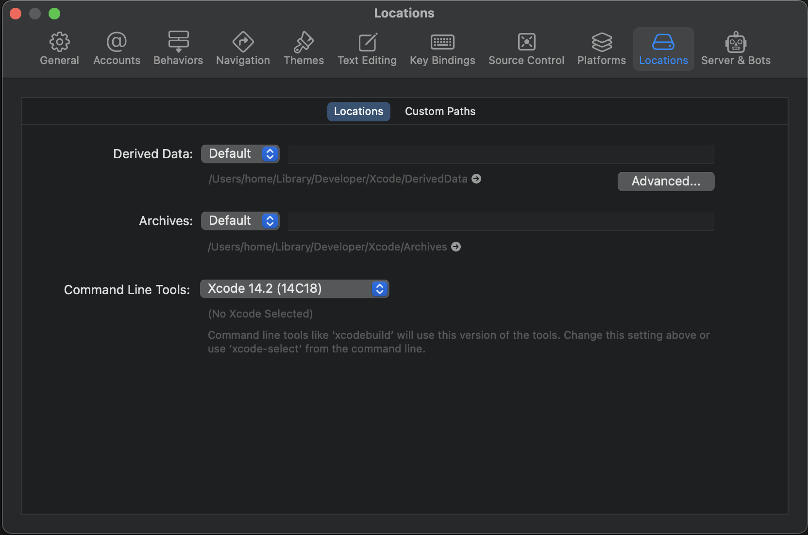
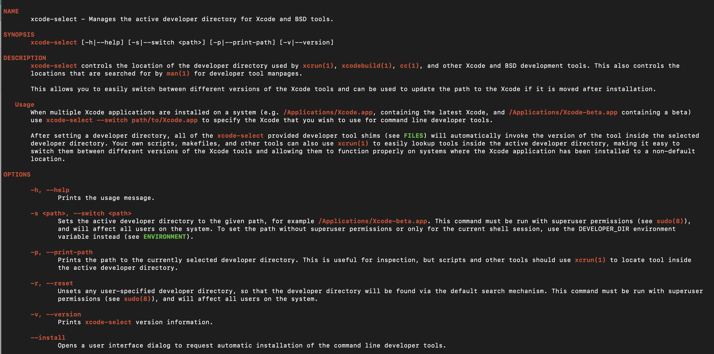
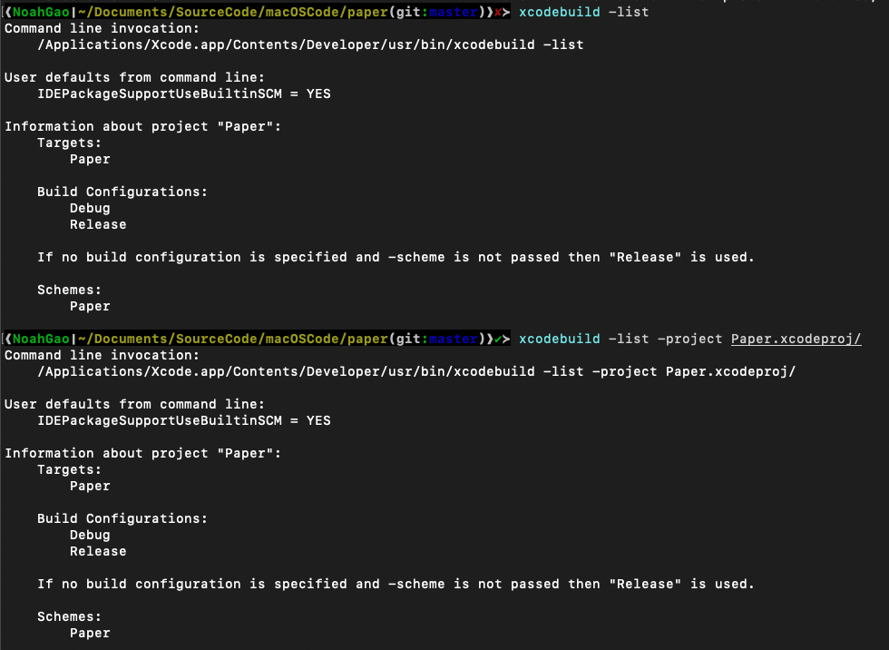

# xcode-select、xcrun、以及 xcodeBuild 理解与实战

标签： iOS macOS

---

[TOC]

在开篇之前，需要先明确以下几点：

+ Xcode 仅仅是一个可视化编辑器，Xcode 执行的 Build、Run、Archive、Export 等大部分操作（Xcode功能非常复杂，没有尝试所有功能）最终是通过命令或者命令的组合来实现的。

+ Xcode 管理好多个 Platform， Xcode 集成了对应 Platforms 的 SDKs 以及对应的工具，可以通过 `xcodebuild -showsdks` 来查看对应的内容, 这也就是 Xcode 包越来越大原因。

明确上面几点后，考虑如下问题:

+ 切换 Xcode 本质以及如何切换 Xcode？
+ Xcode 如何管理不同的 Platform（macosx、iphoneos、iphonesimulator等）？
+ 如何使用 command line tool 进行编译打包？

## 切换 Xcode 本质以及如何切换 Xcode？

首先，我们来说明下如何切换 Xcode， 可以通过如下两种方式进行：

1. Xcode 设置中更改不同版本: Xcode -> Settings -> Locations -> Command Line Tool ;
    

2. 命令行指令 xcode-select: `sudo xcode-select --switch <path>`
    

实际上，在可视化 Xcode 设置里面执行方式 1 切换最终还是使用方式 2 来执行的。


`xcode-select` 是系统预定义在 `/usr/bin/xcode-select`下， 通过 `man xcode-select` 看到对应介绍

> xcode-select - Manages the active developer directory for Xcode and BSD tools.
>
>  xcode-select controls the location of the developer directory used by xcrun(1), xcodebuild(1), cc(1), and other Xcode and BSD development tools. This also controls the locations that are searched for by man(1) for developer tool manpages.

`xcode-select` 本质是管理 Xcode 和 BSD 工具开发者目录（active developer directory）。切换 Xcode 其实也就是切换开发者目录（active developer directory）。切换到不同目录就是为了使用该目录下面的工具、SDKs 等。



## Xcode 如何管理不同的 Platform（macosx、iphoneos、iphonesimulator等）？

`xcode-select` 来管理不同开发者目录，然而在同一个目录下，会存在多平台，每个平台的特殊性使得该平台有不一样的 sdk 和对应的工具。好在系统给开发者提供 `xcrun` 来管理，通过参数 `--sdk` 告诉 `xcrun` 在哪一个平台（Platform）找对应的 开发者工具。默认 sdk 为 macosx。

```shell

#  查找默认 macosx 下面的工具 simctl
xcrun -f simctl

# 查找 iphoneos 下面的工具 traitsutil
xcrun --sdk iphoneos -f traitsutil

```

## 如何使用 command line tool 进行编译打包？

在打包之前，了解一些工程结构内容是很有必要的。

`xxxx.xcworkspace` 代表一个工程组，这个里面可以包含多个 `xxxx.project` 项目，典型就是使用 Cocoapods 管里的 workSpace，workspace 通过 `scheme` 来区分不同的 project

`xxxx.project` 代表一个项目，每个 Project 可以单独进行编译。project 里面可以包含多个 Target， target 可以进行编译，target 通过名字来区分。




workspace、project 以及 target 可以有自己的配置信息，可以通过 `xcodebuild -showBuildSettings -project xxx -target xxx` 查看。


### Build

最简单的可以直接在项目目录运行 `xcodebuild`，它会使用默认的配置信息

```
xcodebuild
```
    
如果你有多个 project 或这你是用 workspace 来进行管理，那么你可能需要使用如下指令
```
# 运行指定的 project
xcodebuild -project name.xcodeproj 

# 运行 workspace 下面某个 project，使用 scheme来区分
xcodebuild -workspace name.xcworkspace -scheme schemename
```

系统默认的 sdk 为 macosx，scheme 默认为第一个 scheme， configuration 默认使用 release，可以进行对应的指定
```
xcodebuild -project name.xcodeproj -sdk sdkname -scheme scheme -configuration Debug 
```

如果想要指定输出目录，可以使用 `-derivedDataPath` 来进行配置

```
xcodebuild -project name.xcodeproj -sdk sdkname -scheme scheme -configuration Debug  -derivedDataPath
```
默认 action 为 build， 你也可以显示定制，具体参数可以通过 `man xcodebuild` 查看

```
xcodebuild -project name.xcodeproj -sdk sdkname -scheme scheme -configuration Debug  -derivedDataPath build

```

### archive 以及 exportArchive

将上序 build 的 action 更换为 archive， 也可以同时指定一个 archivePath

```
xcodebuild -project name.xcodeproj -sdk sdkname -scheme scheme -configuration Debug  -derivedDataPath build  -archivePath xcarchivepath
```


导出 ipa 使用 `exportArchive` , 其中 exportOptionsPlist 文件可以通过 `xcodebuild help` 查看即可

```

xcodebuild -exportArchive -archivePath xcarchivepath -exportPath destinationpath -exportOptionsPlist path

```

最好导出 dSYM 文件，这里面存储调试符号 

```
zip -r ${BUILD_OUTPUT_DIR}/dSYM_${VERSION}[${1}].zip ${BUILD_OUTPUT_DIR}/${1}/${PRODUCT_NAME}.xcarchive/dSYMs/${PRODUCT_NAME}.app.dSYM
```